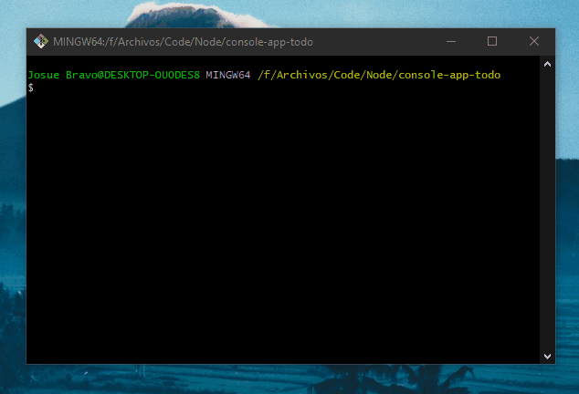

## Console Todo App

---

### How to run

1. `npm install`
2. `node app`

---

### Packages:

- [colors.js](https://www.npmjs.com/package/colors)
- [inquirer.js](https://www.npmjs.com/package/inquirer)
- [uuid](https://www.npmjs.com/package/uuid)

---

### Demo

---

### Technologies

- Node
- Javascript
